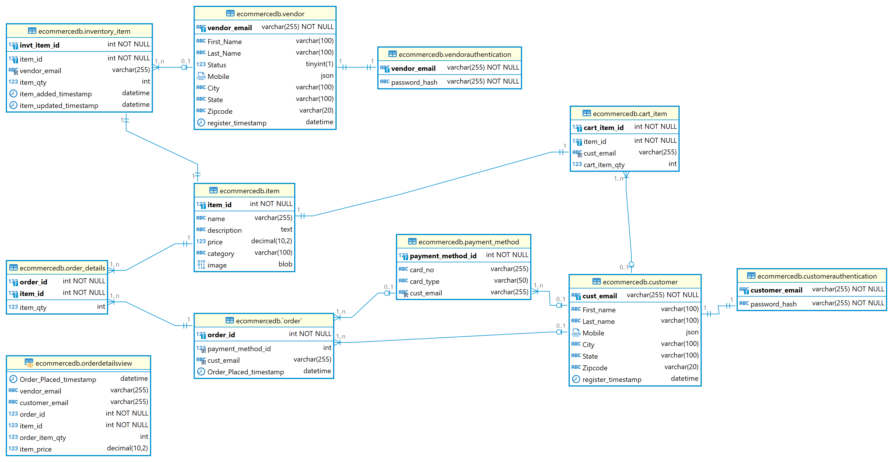

## Project Overview
e-commerce database

Below are the key files and components included in the project:

### Files

- **Database_queries.sql**: Contains SQL queries without view.
- **Database_queries_with_view.sql**: Contains SQL queries with view replacing multiple table joins.
- **database_project.sql**: Contains commands for creating the database schema and tables.
- **dummy_data.sql**: Contains dummy data to be inserted into the database after schema creation.
- **database-12-question.xlsx**: Excel file providing the answer to question 12 from the Database_queries.sql file.
- **ecommercedb_ER_Diagram.png**: ER diagram illustrating the database schema.

### Usage

1. **Database_queries.sql**: Execute these queries to retrieve data without using views.
2. **Database_queries_with_view.sql**: Execute these queries to retrieve data using views, which optimize performance by reducing redundant joins.
3. **database_project.sql**: Use this script to create the database schema and tables required for the e-commerce system.
4. **dummy_data.sql**: Insert dummy data into the database to populate tables for testing purposes.
5. **database-12-question.xlsx**: Refer to this file for the answer to question 12 from the Database_queries.sql results.
6. **ecommercedb_ER_Diagram.png**: View the ER diagram to understand the database schema visually.

### Project Structure

- **Queries**: Contains SQL query files.
- **Database**: Contains database schema and dummy data scripts.
- **Assets**: Contains the ER diagram image.

### ER Diagram

