## Project Overview (e-commerce database)

Below are the key files and components included in the project:

### Files

- **Database_queries.sql**: Contains SQL queries without view.
- **Database_queries_with_view.sql**: Contains SQL queries with view replacing multiple table joins.
- **database_project.sql**: Contains commands for creating the database schema and tables.
- **dummy_data.sql**: Contains dummy data to be inserted into the database after schema creation.
- **database-12-question.xlsx**: Excel file providing the answer to question 12 from the Database_queries.sql file.
- **ecommercedb_ER_Diagram.png**: ER diagram illustrating the database schema.

### Usage

1. **Database_queries.sql**: Execute these queries to retrieve data without using views.
2. **Database_queries_with_view.sql**: Execute these queries to retrieve data using views, which optimize performance by reducing redundant joins.
3. **database_project.sql**: Use this script to create the database schema and tables required for the e-commerce system.
4. **dummy_data.sql**: Insert dummy data into the database to populate tables for testing purposes.
5. **database-12-question.xlsx**: Refer to this file for the answer to question 12 from the Database_queries.sql results.
6. **ecommercedb_ER_Diagram.png**: View the ER diagram to understand the database schema visually.

### Project Structure

- **Queries**: Contains SQL query files.
- **Database**: Contains database schema and dummy data scripts.
- **Assets**: Contains the ER diagram image.

### ER Diagram

### Schema Explanation

1. **VendorAuthentication**:
   - Represents authentication credentials for vendors.
   - Each vendor is uniquely identified by their email (`vendor_email`), serving as the primary key.
   - The `password_hash` column stores the hashed password for authentication.

2. **CustomerAuthentication**:
   - Stores authentication credentials for customers.
   - Similar to `VendorAuthentication`, it also utilizes the email (`customer_email`) as the primary key.
   - Passwords are stored securely in the `password_hash` column.

3. **Vendor**:
   - Contains information about vendors registered on the platform.
   - Each vendor's email (`vendor_email`) serves as both the primary key and a foreign key referencing their authentication details.
   - Additional vendor details include their first and last name, status, contact information (mobile), location (city, state, zipcode), and registration timestamp.

4. **Customer**:
   - Stores customer details.
   - Primary key: `cust_email`, which also serves as a foreign key referencing authentication details from `CustomerAuthentication`.
   - Captures customer information such as first and last name, contact details (mobile), and location.

5. **Item**:
   - Represents individual items available for sale on the platform.
   - Each item has a unique identifier (`item_id`) and includes attributes like name, description, price, category, and image.

6. **Inventory_Item**:
   - Tracks inventory for vendors.
   - Each record corresponds to a specific item (`item_id`) associated with a particular vendor (`vendor_email`).
   - Additional attributes include item quantity, timestamps for item addition and updates.

7. **Payment_method**:
   - Stores payment methods associated with customers.
   - Each payment method has a unique identifier (`payment_method_id`) and includes details such as card number, card type, and the customer's email (`cust_email`).

8. **Order**:
   - Represents orders placed by customers.
   - Each order is uniquely identified by `order_id`.
   - Contains information about the payment method (`payment_method_id`), customer email (`cust_email`), and timestamp for order placement.

9. **Order_Details**:
   - Links orders with the items they contain.
   - It's a junction table between `Order` and `Item`, containing order-specific item details such as item quantity.

10. **Cart_Item**:
    - Stores items added to the cart by customers.
    - Each record corresponds to a specific item (`item_id`) added to the cart by a customer (`cust_email`).
    - It includes the quantity of each item in the cart.

## User Authentication and Registration:

1. **Customer Login Page:**
    - Users need to enter their email and password in the provided fields to sign in to their account.
    - Please refer to the dropdown in the top right corner where users can switch between different login screens.
    - 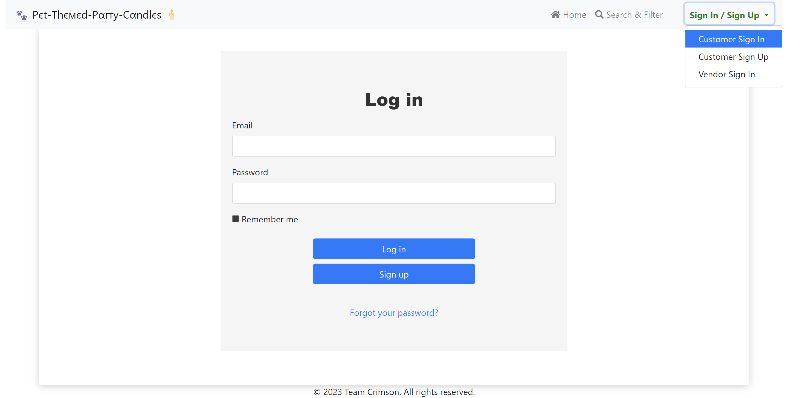

2. **Customer Registration Page:**
    - Users can register on this e-commerce website by providing their details.
    - Without logging in, users can only browse and view items. However, to make purchases, they must sign in to the application.
    - 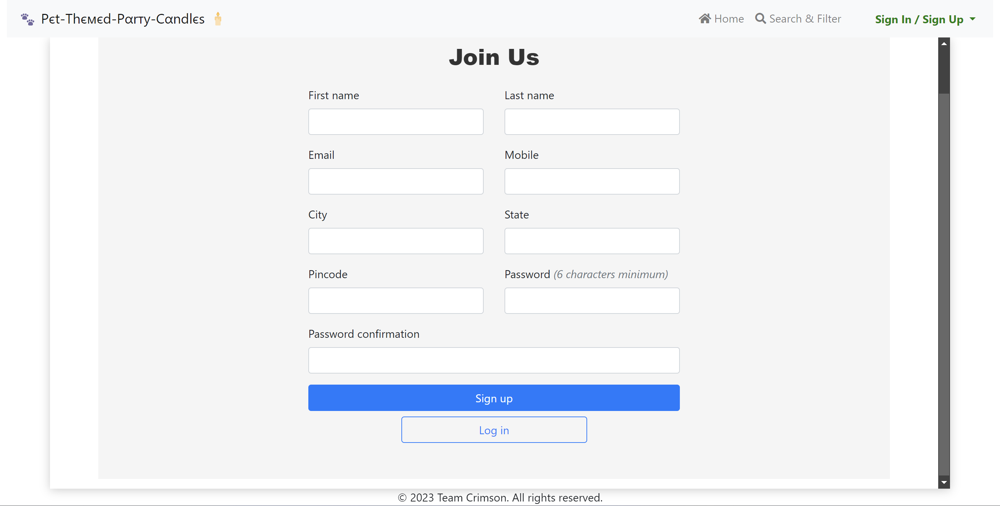

3. **Vendor Login Page:**
    - Similar to user login, vendors can access their dashboard by entering their valid registered email and password.
    - 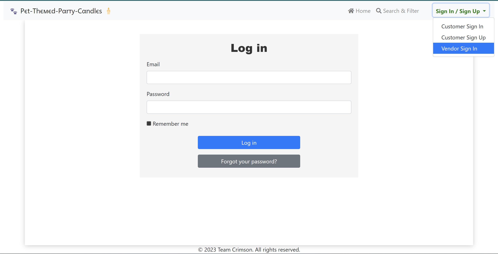

4. **Vendor Registration:**
    - Vendors cannot register directly. They need to contact the company to register on this e-commerce platform to sell their products.
    - Once registered, they can list and sell their products. This screen looks the same as the Customer Registration page.

5. **MySQL Database Tables:**
    - In the MySQL database tables screenshot, we can observe all the tables within the "ecommercedb" schema.
    - To enhance security, passwords are encrypted and stored in the database.
    - 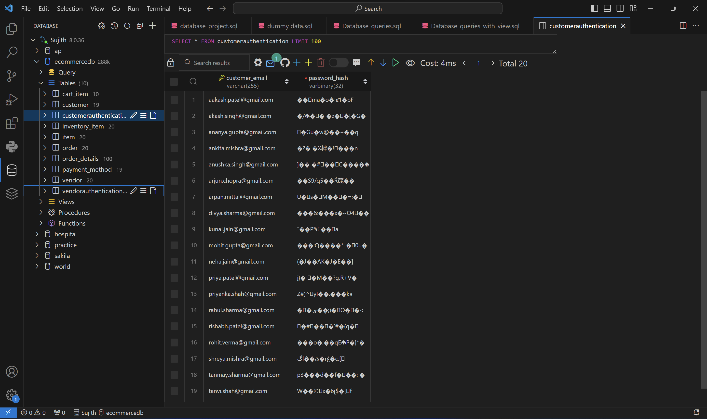

## Customer Dashboard (Order Management, Profile, Shopping Cart & Checkout)

6. **Browsing Products:**
    - Customers can explore all the listed items by vendors on the home screen.
    - Each item is displayed with its name, image, price, and brief description.
    - No login is required to view these details.
    - 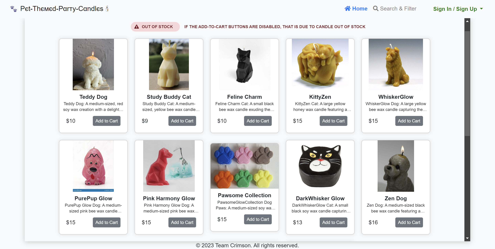

7. **Accessing Product Details:**
    - Customers can access detailed product information by clicking on the product. (No login required)
    - They can view additional details such as product specifications, availability, and vendor information.
    - 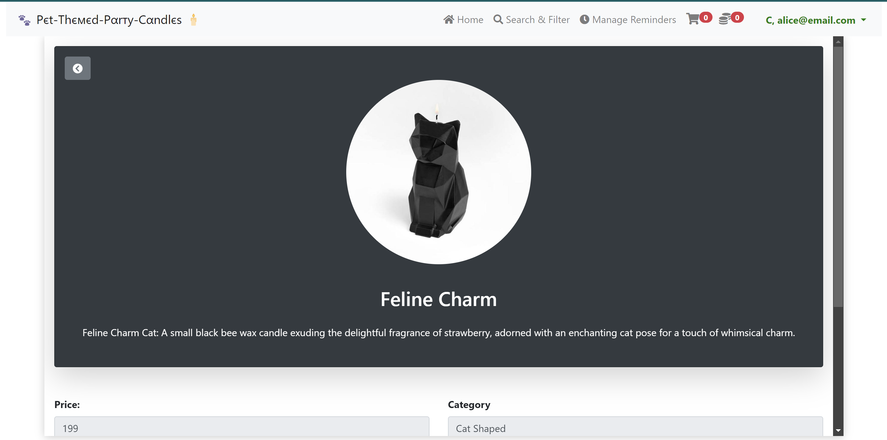

8. **Cart Interaction:**
    - To add items to the cart and make purchases, customers need to sign in to their account.
    - Signing in provides access to additional features like adding items to the cart and managing orders.
    - After signing in, customers can add items to the cart directly from the product details page or the home screen.
    - The "Add to Cart" button will be disabled if items are out of stock, ensuring a seamless shopping experience.
    - Customers can view the contents of their cart and adjust quantities as needed.
    - 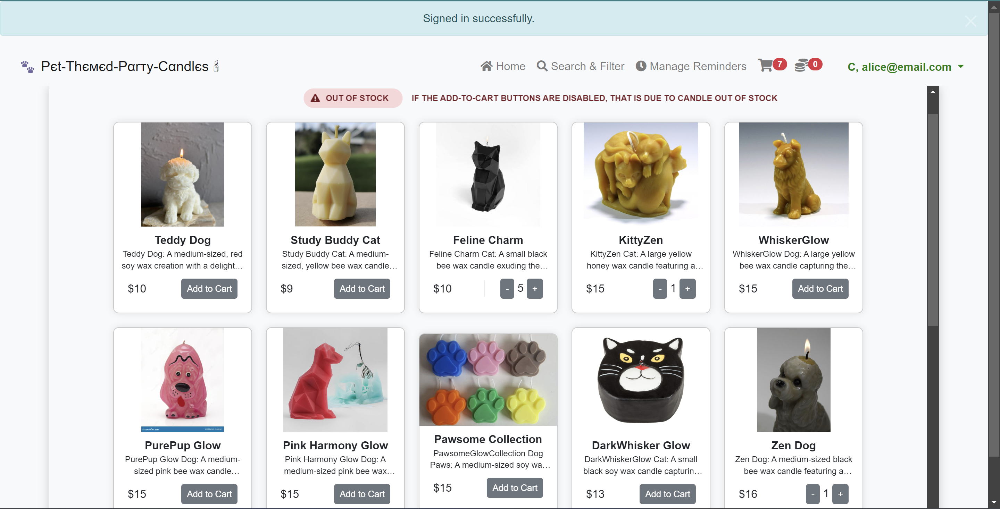
    - 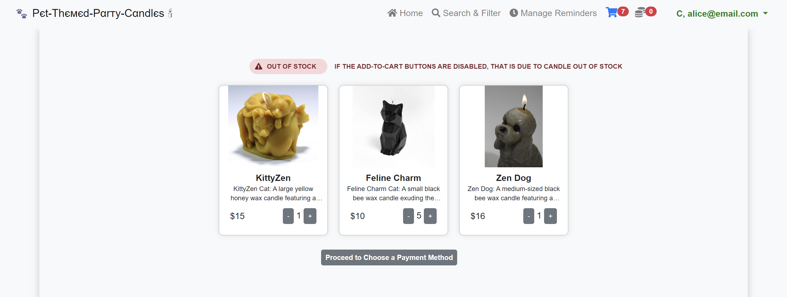

9. **Payment Method:**
    - Before placing the order, customers can select their preferred payment method.
    - They can choose from various payment options or other available methods.
    - 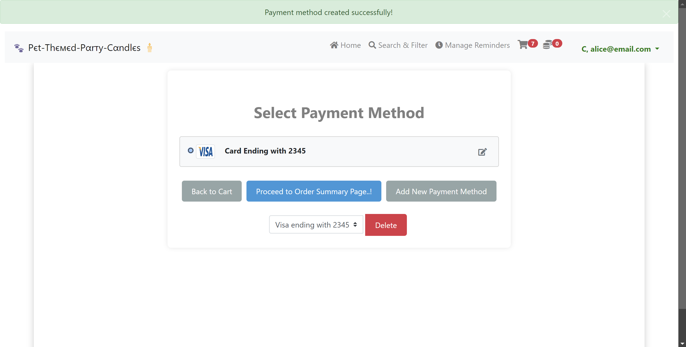
    - 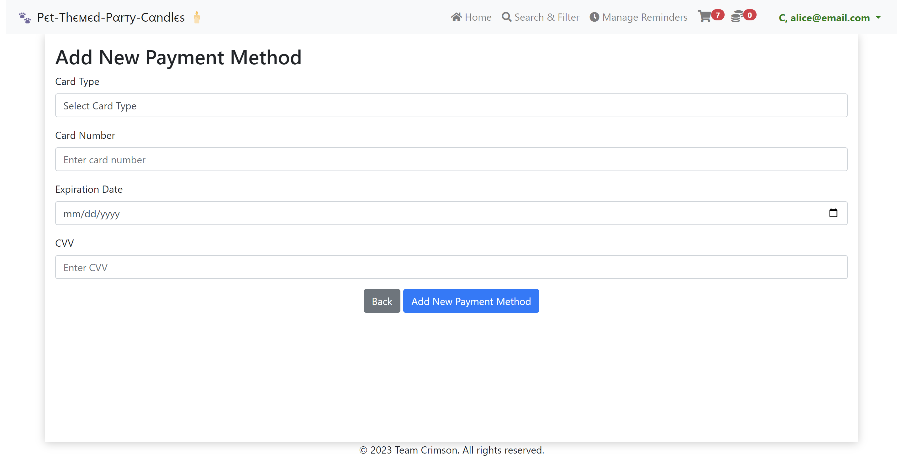

10. **Placing Order:**
    - Once items are added to the cart and the payment method is selected, customers can proceed to place the order.
    - They can review their order summary, including the total cost and selected items, before confirming the purchase.
    - 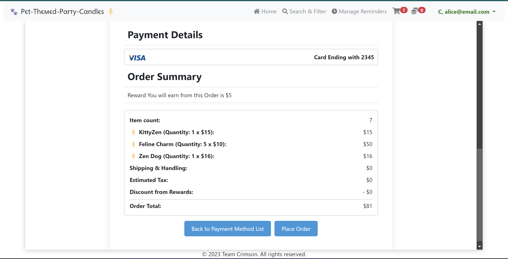
    - 

11. **Viewing Order History & Managing Orders:**
    - After placing an order, customers can view their order history and track the status of their orders.
    - The "Orders" section provides details such as order number, date, and status information.
    - 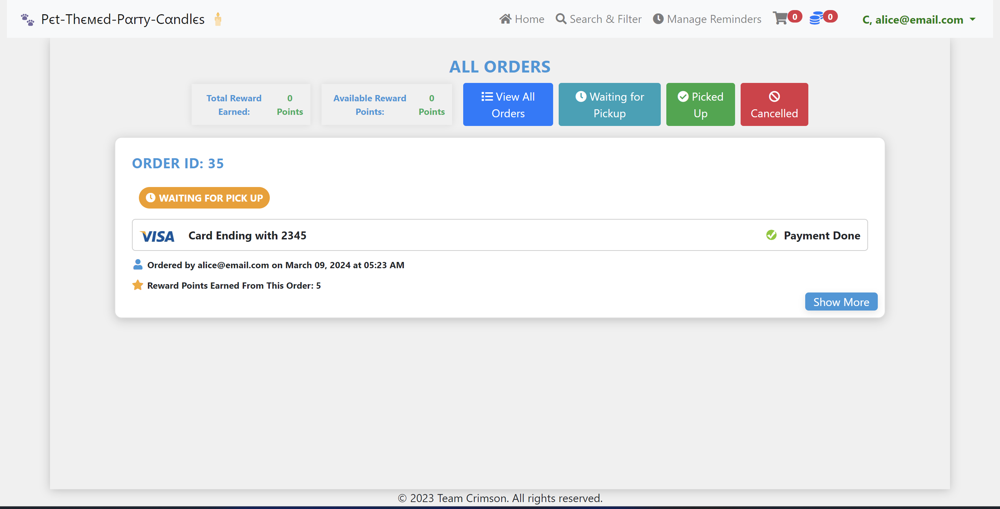
    - 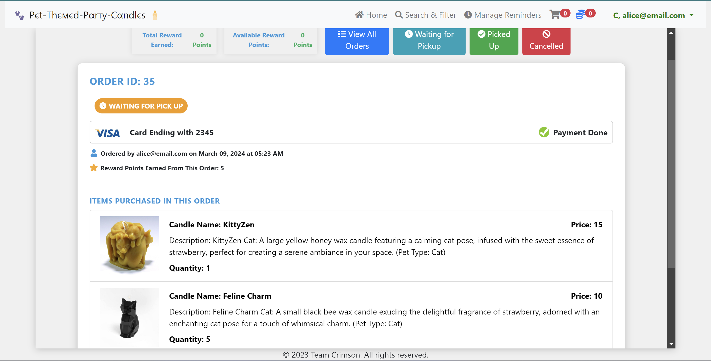

12. **Edit & View Profile:**
    - Customers can update their profile details by clicking on the "Edit Profile" option.
    - Refer to the screenshot titled "Update_Customer_Details" for a visual representation of this feature.
    - 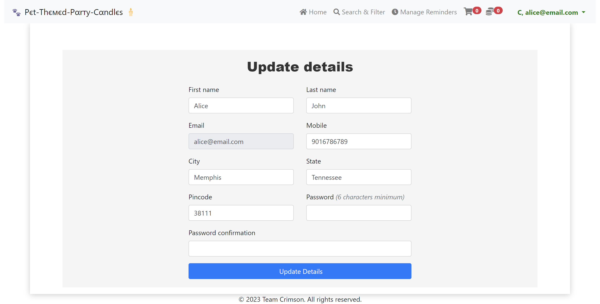

13. **Search and Filter:**
    - Customer/Vendor can search/Filter the products with keywords, category, etc.
    - 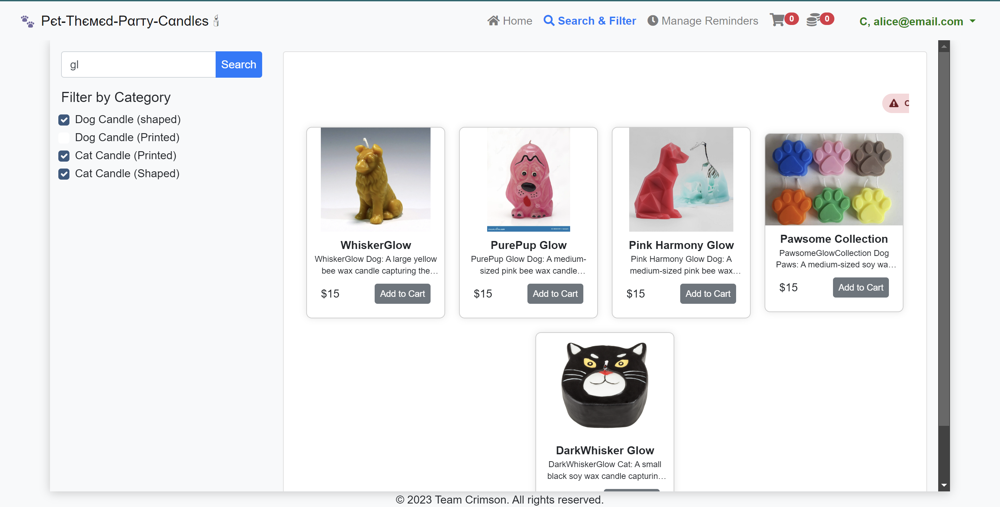

## Vendor Dashboard (Product Management):

14. **Vendor Home Screen:**
    - On the Vendor Home Screen, vendors can view all their registered products along with detailed information such as product details, availability status, and pricing.
    - They will have the capability to delete, update, and view all product-related information.
    - 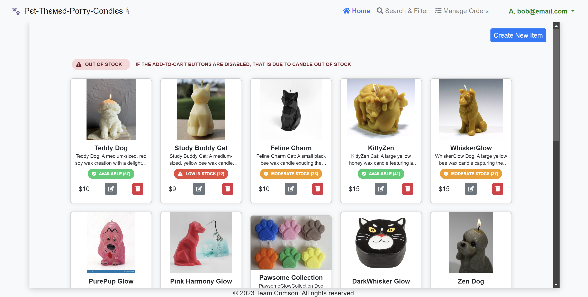

15. **Vendor Product Listing:**
    - Vendors can list their products in this e-commerce application.
    - Please refer to the screenshot "Vendor_Home_Page" where vendors can click on the "Create New Item" button located in the top right corner to register the products they wish to sell.
    - 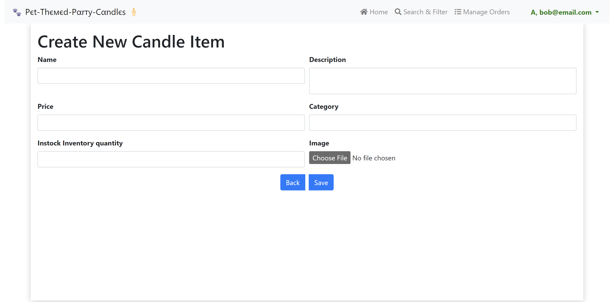

16. **Vendor Edit Product Details:**
    - Vendors have the ability to edit product details.
    - The screenshot titled "Vendor_Edit_Item_Details" illustrates this feature.
    - 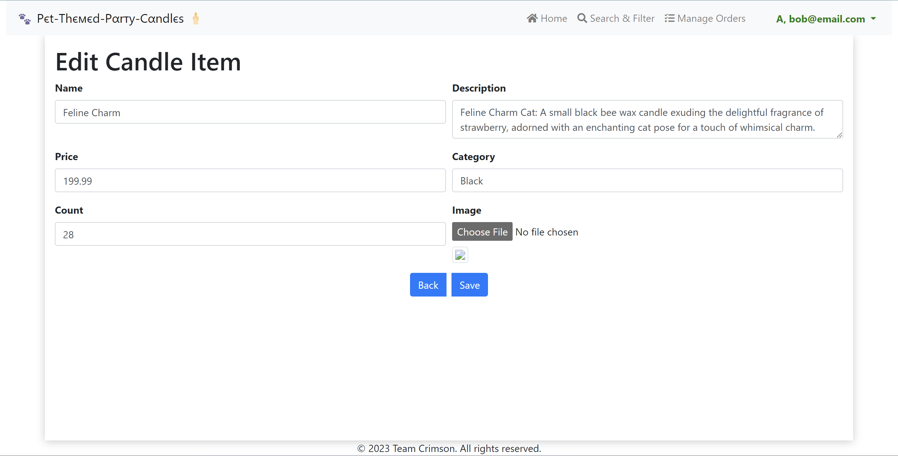

17. **Vendor Order Management:**
    - Vendors possess the capability to access all placed orders from suppliers and can efficiently manage them.
    - This includes the ability to modify the status of each order as needed.
    - 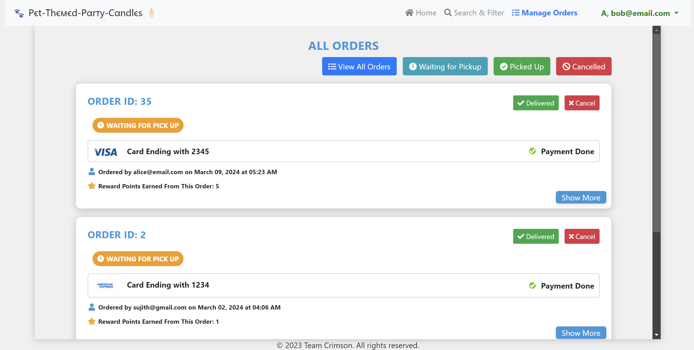

### Tables Screenshots

1. **VendorAuthentication Table:**
   
   Description: Screenshot showcasing the structure of the VendorAuthentication table, including its columns and data.

2. **CustomerAuthentication Table:**
   
   Description: Screenshot displaying the structure of the CustomerAuthentication table, including its columns and data.

3. **Vendor Table:**
   
   Description: Screenshot illustrating the structure of the Vendor table, showcasing its columns and data.

4. **Customer Table:**
   
   Description: Screenshot representing the structure of the Customer table, displaying its columns and data.

5. **Item Table:**
   
   Description: Screenshot depicting the structure of the Item table, including its columns and data.

6. **Inventory_Item Table:**
   
   Description: Screenshot presenting the structure of the Inventory_Item table, showcasing its columns and data.

7. **Payment_method Table:**
   
   Description: Screenshot showing the structure of the Payment_method table, including its columns and data.

8. **Order Table:**
   
   Description: Screenshot displaying the structure of the Order table, illustrating its columns and data.

9. **Order_Details Table:**
   
   Description: Screenshot representing the structure of the Order_Details table, showcasing its columns and data.

10. **Cart_Item Table:**
    
    Description: Screenshot illustrating the structure of the Cart_Item table, including its columns and data.
